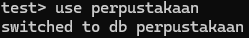

# mongodbapp


# 1. Introduction
Library Application to simulate borrowing book and record all the borrowing and returning (active or not active) by which customer and book in database.


# 2. Dataset
Syntetic data that manually created using sql. Specifically create table `customers` and `borrows` in MySQL. Whereas create a table `books` in MongoDB.


# 3. Requirements
For this exercise project, very important to have installed both DB below:
- MySQL
- MongoDB

Here, used two libraries to generate API:
- Flask
- FastApi

# 4. Project Flow


Shown in the figure, there are two blocks based on the component frameworks:
- **MySQL + Flask** (using SQLAlchemy as the ORM)
- **MongoDB + FastAPI** (using MongoEngine as the ODM)

Each of them have three components:
1. **Model**: connecting database and API 
2. **Controller**: accessing all functionalities
3. **Router**: connecting all endpoints

While to access the `borrows` tables we set the microservice security layer by adding the token requirement from JWT.


## 4.1. Project Structure
```
├──  perpustakaan-project\

  ├── venv\ (the virtual environment in gitignore list)

  ├── .gitignore
  ├── README.md
  ├── requirements.txt
  ├── db.sql
  ├── sample_request_token.txt
  
  ├── images\

  ├── perpustakaan-app\

    ├── mongodbapp\
      ├── .env
      ├── __init__.py
      ├── config.py
      ├── main.py
      ├── books_controller.py
      ├── books_router.py

      ├── models\
        ├── __init__.py
        ├── books_model.py

    ├── mysqlapp\
      ├── .env
      ├── config.py
      ├── main.py

      ├── app\
        ├── __init__.py

        ├── models\
          ├── __init__.py
          ├── borrows_model.py
          ├── customers_model.py

        ├── controllers\
          ├── __init__.py
          ├── borrows_controller.py
          ├── customers_controller.py

        ├── routers\
          ├── __init__.py
          ├── borrows_router.py
          ├── customers_router.py
```

## 4.2. How to run the apps
### 4.2.1. Run webserver of FastAPI
First, need to run the FastAPI, since it the API for `books` data will be consumed by `borrows` (Flask)

Here is the format to execute FastAPI
```
uvicorn {module name}:{FastAPI instance name} --port {any port available} --reload
```

That means here is the command for the project
```
uvicorn main:app --port 8000 --reload
```

### 4.2.2. Run webserver of Flask


# 5. Output


# Appendix
## MongoDB Basic Commands
#### 1. Run `Mongod`
It is responsible for running the MongoDB server.

- open cmd (for OS windows)
- use this command:
```
mongod
```

#### 2. Run `Mongosh`
It is responsible for running the MongoDB server.

- open cmd (for OS windows)
- use this command:
```
mongosh
```

#### 3. Create New Database
- using mongosh
- check existing database
```
show dbs
```

- Here we created new database named `perpustakaan`
- the newly created database will not appear using command `show dbs`, since to appear need a collection that have at least a record data within it.

#### 4. Create New Collection
- using mongosh
- select `perpustakaan` database
```
use perpustakaan
```

- create new collection named `books` then insert a testing data
```
db.books.insertOne({name:"test"})
```

- check the newly created collection
```
show collections
```

