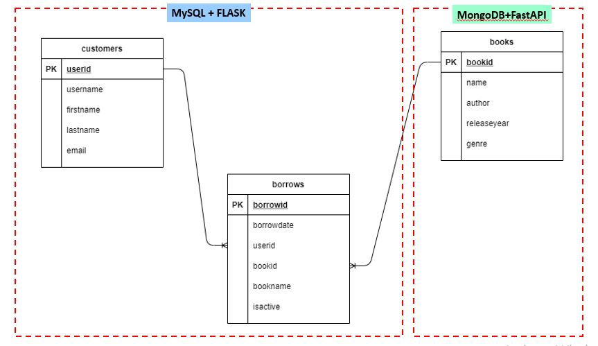

# mongodbapp

# 1. Introduction
Library Application to simulate borrowing book and record all the borrowing and returning (active or not active) by which customer and book in database.

# 2. Dataset
Syntetic data that manually created using sql. Specifically create table `customers` and `borrows` in MySQL. Whereas create a table `books` in MongoDB.

# 3. Requirements
For this exercise project, very important to have installed both DB below:
- MySQL
- MongoDB

Here, used two libraries to generate API:
- Flask
- FastApiw

# 4. Project Flow

## Project Structure
|-- perpustakaan
    |-- README.md
    |-- db.sql
    |-- sample_request_token.txt
    |-- images\
    |-- perpustakaan-app\
        |-- mongodbapp\
        |-- mysqlapp\
            |-- app\
                |-- __init__.py
                |-- model\
                    |-- __init__.py
                |-- controller\
                    |-- __init__.py
                |-- router\
                    |-- __init__.py

 

# perpustakaan-project

* [images/](. /perpustakaan /images)
  * [erd-with-flow.jpg](. /perpustakaan-project /images /erd-with-flow.jpg)
  * [erd.png](. /perpustakaan-project /images /erd.png)
* [perpustakaan-app/](. /perpustakaan-project /perpustakaan-app)
  * [mongodbapp/](. /perpustakaan-project /perpustakaan-app /mongodbapp)
    * [models/](. /perpustakaan-project /perpustakaan-app /mongodbapp /models)
      * [books_model.py](. /perpustakaan-project /perpustakaan-app /mongodbapp /models /books_model.py)
      * [__init__.py](. /perpustakaan-project /perpustakaan-app /mongodbapp /models /__init__.py)
    * [.env](. /perpustakaan-project /perpustakaan-app /mongodbapp /.env)
    * [books_controller.py](. /perpustakaan-project /perpustakaan-app /mongodbapp /books_controller.py)
    * [books_router.py](. /perpustakaan-project /perpustakaan-app /mongodbapp /books_router.py)
    * [config.py](. /perpustakaan-project /perpustakaan-app /mongodbapp /config.py)
    * [main.py](. /perpustakaan-project /perpustakaan-app /mongodbapp /main.py)
    * [__init__.py](. /perpustakaan-project /perpustakaan-app /mongodbapp /__init__.py)
  * [mysqlapp/](. /perpustakaan-project /perpustakaan-app /mysqlapp)
    * [app/](. /perpustakaan-project /perpustakaan-app /mysqlapp /app)
      * [controllers/](. /perpustakaan-project /perpustakaan-app /mysqlapp /app /controllers)
      * [models/](. /perpustakaan-project /perpustakaan-app /mysqlapp /app /models)
      * [routers/](. /perpustakaan-project /perpustakaan-app /mysqlapp /app /routers)
      * [__pycache__/](. /perpustakaan-project /perpustakaan-app /mysqlapp /app /__pycache__)
      * [__init__.py](. /perpustakaan-project /perpustakaan-app /mysqlapp /app /__init__.py)
    * [__pycache__/](. /perpustakaan-project /perpustakaan-app /mysqlapp /__pycache__)
      * [config.cpython-39.pyc](. /perpustakaan-project /perpustakaan-app /mysqlapp /__pycache__ /config.cpython-39.pyc)
    * [.env](. /perpustakaan-project /perpustakaan-app /mysqlapp /.env)
    * [config.py](. /perpustakaan-project /perpustakaan-app /mysqlapp /config.py)
    * [main.py](. /perpustakaan-project /perpustakaan-app /mysqlapp /main.py)
    * [test.py](. /perpustakaan-project /perpustakaan-app /mysqlapp /test.py)
  * [concept.jpg](. /perpustakaan-project /perpustakaan-app /concept.jpg)
  * [notes.md](. /perpustakaan-project /perpustakaan-app /notes.md)
* [db.sql](. /perpustakaan-project /db.sql)
* [erd.png](. /perpustakaan-project /erd.png)
* [notes.md](. /perpustakaan-project /notes.md)
* [README.md](. /perpustakaan-project /README.md)
* [requirements.txt](. /perpustakaan-project /requirements.txt)
* [sample_request_token.txt](. /perpustakaan-project /sample_request_token.txt)

## Database Schema
- MySQL
    DB Schema: perpustakaan
    Tables:
    - customers
    - borrows

- MongoDB
    DB Schema: perpustakaan
    Table:
    - books

# 5. Output