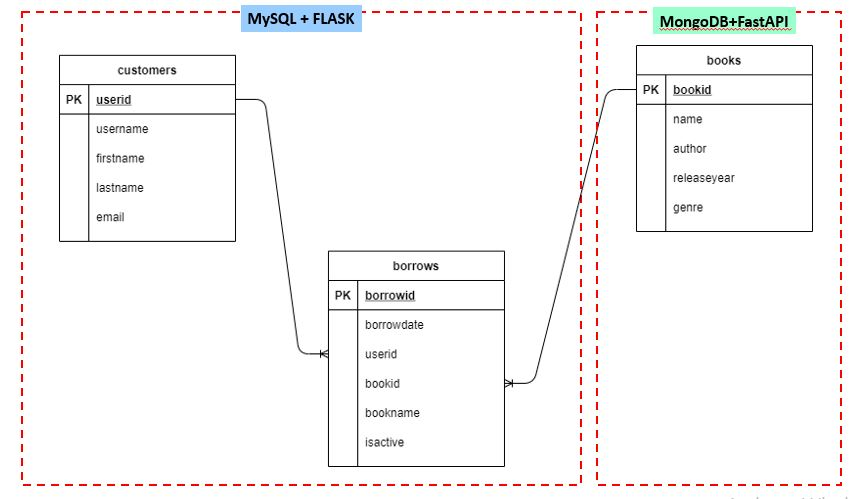

# mongodbapp

# 1. Introduction
Library Application to simulate borrowing book and record all the borrowing and returning (active or not active) by which customer and book in database.

# 2. Dataset
Syntetic data that manually created using sql. Specifically create table `customers` and `borrows` in MySQL. Whereas create a table `books` in MongoDB.

# 3. Requirements
For this exercise project, very important to have installed both DB below:
- MySQL
- MongoDB

Here, used two libraries to generate API:
- Flask
- FastApiw

# 4. Project Flow

## Project Structure
|-- perpustakaan
    |-- README.md
    |-- db.sql
    |-- sample_request_token.txt
    |-- images\
    |-- perpustakaan-app\
        |-- mongodbapp\
        |-- mysqlapp\
            |-- app\
                |-- __init__.py
                |-- model\
                    |-- __init__.py
                |-- controller\
                    |-- __init__.py
                |-- router\
                    |-- __init__.py
                

## Database Schema
- MySQL
    DB Schema: perpustakaan
    Tables:
    - customers
    - borrows

- MongoDB
    DB Schema: perpustakaan
    Table:
    - books

# 5. Output