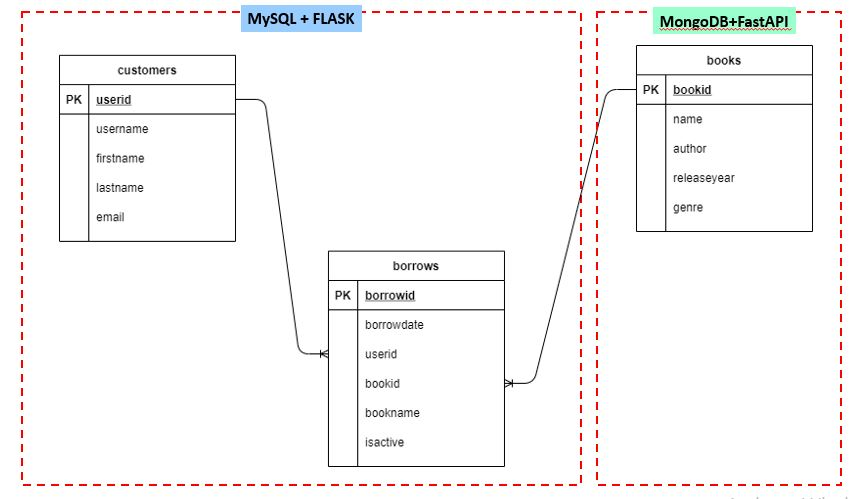

# mongodbapp

# About
Library Application to simulate borrowing book and record all the borrowing and returning (active or not active) by which user and book in database.

# Concept

# Framework
## User Database
- MySQL
- Flask

## Book Database
- MongoDB
- FastAPI

# Data Base Schema
- MySQL
    - perpustakaan_project
        - customers
        - borrows

- MongoDB
    - perpustakaan_project
        - books